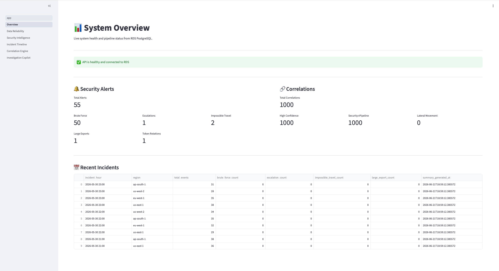
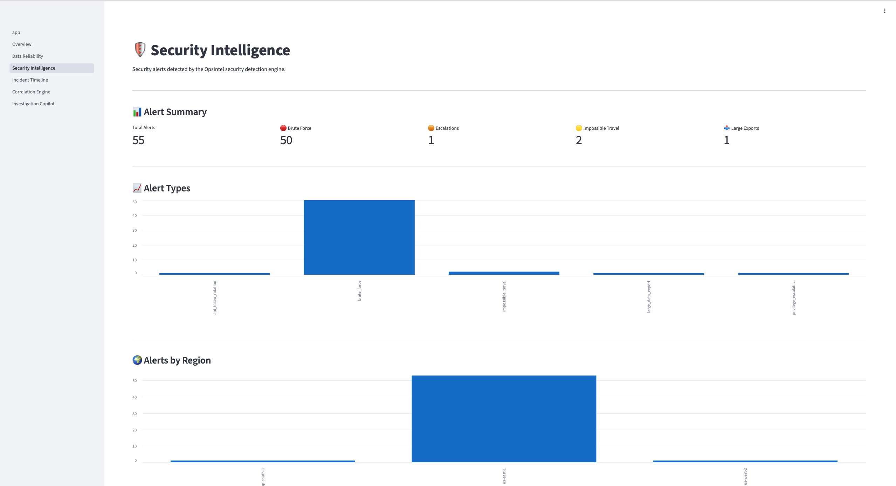
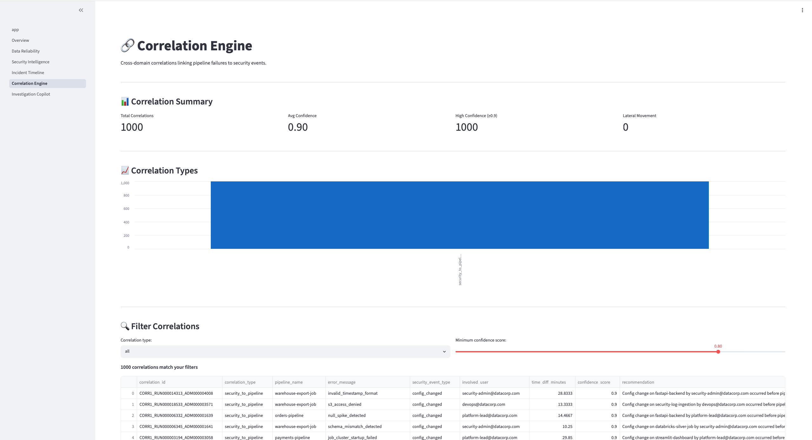
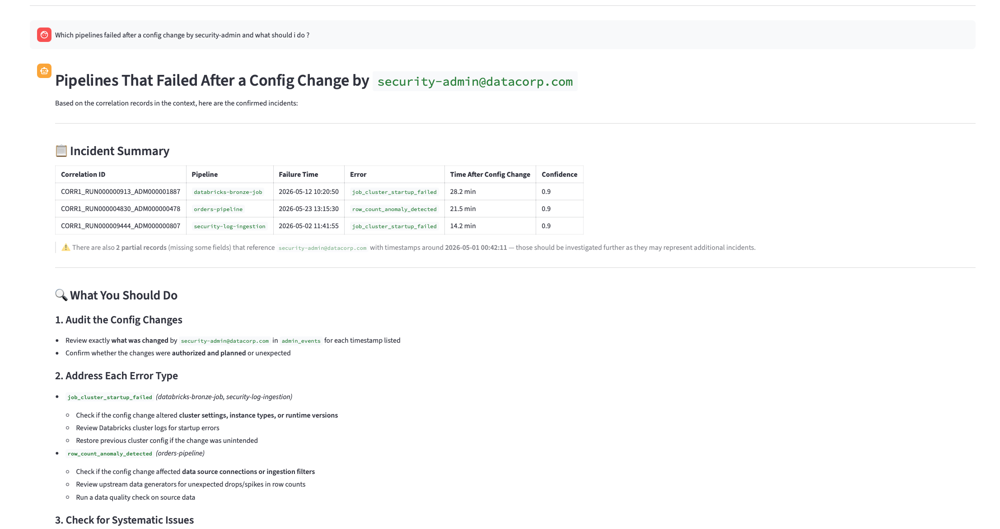

# OpsIntel Copilot

**AWS-Native AI Data Reliability & Security Investigation Platform**


OpsIntel Copilot is a fully deployed, production-grade AWS-native platform that detects data pipeline failures and security incidents, correlates them across domains using a PySpark correlation engine, and answers natural language investigation questions using an Amazon Bedrock RAG copilot — all running on AWS ECS Fargate.

---

## Live Demo

| Service | URL |
|---------|-----|
| Streamlit Dashboard | http://3.91.170.60:8501 |
| FastAPI Swagger UI | http://44.221.58.68:8000/docs |

---

## Screenshots

### System Overview — Live data from RDS PostgreSQL


### Security Intelligence — 55 alerts, charts by type and region


### Correlation Engine — 1,496 cross-domain correlations, confidence slider


### Investigation Copilot — RAG-grounded AI answers from actual incident data


---

## What Makes This Project Exceptional

| Feature | Why It Matters |
|---------|---------------|
| dbt ELT Lakehouse | Staging, silver, gold with macros, custom tests, SCD Type 2, Elementary observability — not just notebooks |
| Correlation Engine | PySpark cross-domain correlator linking pipeline failures to security events with confidence scores — strongest technical feature |
| Bedrock RAG Copilot | Amazon Bedrock Knowledge Bases over S3 rag-docs — evidence-grounded answers to investigation questions |
| Data Contracts | Formal YAML contracts enforced by dbt and generator validation — hottest topic in data engineering |
| Unity Catalog | Delta tables registered with descriptions, owners, tags, Delta CDF for CDC |
| CI/CD for Data | GitHub Actions running dbt test + SQLFluff + terraform validate on every PR |
| Secrets Management | AWS Secrets Manager for all credentials — zero secrets in codebase |
| Full Deployment | ECS Fargate + ECR + ALB + CloudWatch — not just a local demo |

---

## Architecture
┌─────────────────────────────────────────────────────────┐

│                        AWS                              │

│                                                         │

│  ECS Scheduled Task                                     │

│  (Data Generators)                                      │

│       ↓ validates against data contracts                │

│  S3 raw/ → S3 bronze/ → S3 silver/ → S3 gold/          │

│       ↓                                                 │

│  Databricks on AWS                                      │

│  (PySpark + Delta Lake + Unity Catalog)                 │

│       ↓                                                 │

│  dbt-databricks                                         │

│  (staging → silver → gold + SCD Type 2 snapshots)      │

│       ↓                                                 │

│  RDS PostgreSQL                                         │

│  (incidents, alerts, correlations, quality)             │

│       ↓                                                 │

│  Amazon Bedrock Knowledge Base                          │

│  (RAG over S3 rag-docs + OpenSearch Serverless)         │

│       ↓                                                 │

│  FastAPI on ECS Fargate (:8000)                         │

│       ↓                                                 │

│  Streamlit on ECS Fargate (:8501)                       │

└─────────────────────────────────────────────────────────┘
---

## Full Tech Stack

### AWS Services
| Service | Purpose |
|---------|---------|
| S3 | Raw, bronze, silver, gold, rag-docs, checkpoints storage |
| ECS Fargate | Serverless container hosting for FastAPI and Streamlit |
| ECR | Docker image registry |
| RDS PostgreSQL | Metadata store (incidents, alerts, correlations, quality, RAG history) |
| Amazon Bedrock | LLM inference (Claude Sonnet 4.6) + Knowledge Bases (managed RAG) |
| OpenSearch Serverless | Vector store behind Bedrock Knowledge Base |
| Secrets Manager | All credentials (RDS, Databricks, Bedrock) — zero .env files |
| CloudWatch | Logs, metrics, and alarms for ECS services |
| IAM | Role-based access for ECS tasks (S3, Bedrock, Secrets Manager) |

### Data Platform
| Tool | Purpose |
|------|---------|
| Databricks on AWS | PySpark processing, Delta Lake, Unity Catalog, Lakeflow Jobs |
| Delta Lake | ACID transactions, schema enforcement, time travel, Change Data Feed |
| Unity Catalog | Table registration, descriptions, owners, tags, data contracts |
| dbt-databricks | ELT transformation layer (staging → silver → gold) |
| Elementary | dbt test result history, anomaly detection, data observability |

### dbt Layer
| Component | Details |
|-----------|---------|
| Staging models | Type casting and column renaming only — no business logic |
| Silver models | Business logic, macro validation, suspicious event flagging |
| Gold models | Incident summary, security alerts, correlations, data quality |
| Macros | is_valid_timestamp(), is_valid_currency(), flag_suspicious_event() |
| Custom tests | assert_no_impossible_travel, assert_row_count_not_dropped |
| SCD Type 2 | incident_status_snapshot, security_alert_snapshot |
| Exposures | Links gold models to FastAPI and Streamlit |
| Source freshness | Warns after 6 hours, errors after 24 hours |

### Backend (FastAPI)
| Endpoint | Description |
|----------|-------------|
| GET /health | ECS load balancer health check |
| GET /incidents | Incident summaries from RDS |
| GET /security-alerts | Security alerts with event type filter |
| GET /correlations | Cross-domain correlations with confidence filter |
| GET /data-quality | Data quality results with flag filter |
| GET /timeline | Chronological event timeline |
| GET /copilot/history | RAG query history from RDS |
| POST /copilot/ask | Bedrock RAG — natural language investigation |
| POST /databricks/run-job | Trigger Databricks pipeline job |
| GET /databricks/job-status | Check Databricks job run status |

### Dashboard (Streamlit — 6 Pages)
| Page | Contents |
|------|---------|
| Overview | API health, alert counts, correlation summary, recent incidents |
| Data Reliability | Quality results, flag distribution chart, filterable records |
| Security Intelligence | Alert summary, charts by type and region, filterable alert table |
| Incident Timeline | Chronological security events and correlations |
| Correlation Engine | Cross-domain correlations, confidence slider, recommendations |
| Investigation Copilot | Chat interface powered by Bedrock RAG |

---

## The Correlation Engine

The strongest technical feature. A PySpark job that links pipeline failures to security events using configurable time-window rules:
IF pipeline failure within 30 minutes of suspicious admin config change

THEN create security_to_pipeline correlation (confidence: 0.9)
IF privilege escalation within 10 minutes of API token rotation

THEN create lateral_movement correlation (confidence: 0.9)
IF large data export within 2 hours of impossible travel

THEN create exfiltration correlation (confidence: 0.8)
Output: 1,496 correlations stored in RDS PostgreSQL and indexed in Bedrock RAG.

Each correlation record contains:
- correlation_id, correlation_type
- pipeline_run_id, pipeline_name, pipeline_failed_at, error_message
- security_event_id, security_event_type, security_event_at
- involved_user, time_diff_minutes, confidence_score
- recommendation

---

## The RAG Copilot

Amazon Bedrock Knowledge Base indexes 4 document types from S3:

| Document | Contents |
|----------|---------|
| correlations/correlation_summaries.txt | 200 correlation records with full context |
| security/security_alerts.txt | 55 security alert summaries |
| incidents/incident_summaries.txt | 100 incident summaries |
| playbooks/ | Brute force, privilege escalation, pipeline failure playbooks |

When you ask a question:
1. Bedrock retrieves the 5 most relevant document chunks
2. Chunks + question are sent to Claude Sonnet 4.6
3. Claude generates an evidence-grounded answer with source citations
4. Answer and sources are returned via FastAPI and displayed in Streamlit

Example question and answer:

**Q: Which pipelines failed after a config change by security-admin?**

**A:** databricks-bronze-job (2026-05-12, job_cluster_startup_failed, 28.2 min after config change), orders-pipeline (2026-05-23, row_count_anomaly_detected, 21.5 min), security-log-ingestion (2026-05-02, job_cluster_startup_failed, 14.2 min). All confidence 0.9. Priority: security-log-ingestion going down after a config change may indicate an attempt to suppress audit visibility.

---

## Data Contracts

Formal YAML contracts define schema, SLAs, ownership, and quality rules for every data domain:

```yaml
domain: payments
owner: data-engineering
version: 1.0.0
sla:
  freshness_hours: 6
  availability_percent: 99.5
  row_count_minimum: 500
schema:
  - field: order_id
    type: STRING
    required: true
    unique: true
  - field: amount
    type: DECIMAL
    constraints: amount > 0
  - field: currency
    type: STRING
    allowed_values: [USD, EUR, GBP, JPY, CAD]
```

Enforced by dbt source tests and validated by the data generator before any file reaches S3.

---

## CI/CD Pipeline

GitHub Actions runs on every PR:
dbt_ci.yml          → dbt deps + compile + test + SQLFluff lint (on dbt/** changes)

terraform_validate  → terraform init + validate + plan (on infra/** changes)

integration_test    → API smoke tests (on merge to main)
---

## Delta Lake Features

| Feature | Implementation |
|---------|---------------|
| ACID Transactions | All bronze, silver, gold tables use Delta format |
| Schema Enforcement | Bronze ingestion enforces schema on write |
| Time Travel | FastAPI GET /data/rollback endpoint reads AS OF timestamp |
| Change Data Feed | Delta CDF enabled on silver tables, consumed by correlation engine |
| SCD Type 2 | dbt snapshots track incident and alert lifecycle with dbt_valid_from/dbt_valid_to |

---

## Secrets Management

All credentials stored in AWS Secrets Manager:
opsintel/rds/credentials     → RDS username and password

opsintel/databricks/token    → Databricks API token

opsintel/bedrock/api_key     → Bedrock API key
FastAPI fetches secrets at runtime via IAM-based access. Zero secrets in the codebase, zero .env files in production.

---

## Data Flow (Step by Step)
Step 1:  Generators create orders, security logs, admin events

Step 2:  Validate each file against its data contract

Step 3:  Upload to S3 raw/

Step 4:  Databricks reads S3 raw → writes Delta bronze tables

Step 5:  Unity Catalog registers bronze tables with descriptions and tags

Step 6:  dbt source freshness check (fail if SLA violated)

Step 7:  dbt staging models (type casting only)

Step 8:  dbt silver models (business logic, macros)

Step 9:  dbt silver tests (impossible travel, row count anomaly)

Step 10: PySpark security detection (brute force, escalation, impossible travel)

Step 11: PySpark incident timeline builder

Step 12: PySpark correlation engine (1,496 correlations)

Step 13: dbt gold models (incident summary, security alerts, correlations)

Step 14: dbt SCD Type 2 snapshots

Step 15: dbt gold tests

Step 16: Delta CDF consumer feeds changes to correlation signals

Step 17: Databricks syncs to RDS PostgreSQL (4 tables)

Step 18: RAG documents pushed to S3 rag-docs/

Step 19: Bedrock Knowledge Base syncs from S3

Step 20: FastAPI and Streamlit serve live dashboard
---

## Repository Structure
opsintel-copilot/

│

├── .github/workflows/

│   ├── dbt_ci.yml                  ← dbt test + SQLFluff on every PR

│   ├── terraform_validate.yml      ← terraform validate + plan on infra PRs

│   └── integration_test.yml        ← API smoke tests on merge to main

│

├── contracts/

│   ├── orders_contract.yml

│   ├── security_logs_contract.yml

│   └── admin_events_contract.yml

│

├── dbt/

│   ├── models/

│   │   ├── staging/                ← stg_orders, stg_security_logs, stg_admin_events

│   │   ├── silver/                 ← silver_orders, silver_security_logs, silver_admin_events

│   │   └── gold/                   ← gold_incident_summary, gold_security_alerts, gold_correlation_records

│   ├── macros/                     ← is_valid_timestamp, is_valid_currency, flag_suspicious_event

│   ├── tests/                      ← assert_no_impossible_travel, assert_row_count_not_dropped

│   └── snapshots/                  ← incident_status_snapshot, security_alert_snapshot

│

├── databricks/notebooks/

│   ├── 01_bronze_ingestion.py

│   ├── 02_unity_catalog_register.py

│   ├── 03_security_detection.py

│   ├── 04_incident_timeline.py

│   ├── 05_correlation_engine.py

│   ├── 06_delta_cdf_consumer.py

│   ├── 07_time_travel_demo.py

│   ├── 08_sync_to_rds.py

│   └── 09_generate_rag_docs.py

│

├── infra/terraform/

│   ├── main.tf, provider.tf, variables.tf, outputs.tf

│   ├── s3.tf                       ← S3 bucket with folders and encryption

│   ├── rds.tf                      ← RDS PostgreSQL with subnet group

│   ├── ecr.tf                      ← ECR repositories

│   ├── ecs_fastapi.tf              ← ECS Fargate for FastAPI

│   ├── ecs_streamlit.tf            ← ECS Fargate for Streamlit

│   ├── iam.tf                      ← ECS task roles and policies

│   ├── secrets_manager.tf          ← Secrets for RDS, Databricks, Bedrock

│   ├── cloudwatch.tf               ← Log groups and alarms

│   └── cost_tags.tf                ← Cost allocation tags on every resource

│

├── services/

│   ├── api/

│   │   ├── main.py                 ← FastAPI app

│   │   ├── routes_incidents.py

│   │   ├── routes_correlation.py

│   │   ├── routes_copilot.py

│   │   ├── routes_admin.py

│   │   ├── routes_timeline.py

│   │   ├── bedrock_client.py       ← Bedrock RAG (retrieve + invoke)

│   │   ├── rds_client.py           ← All PostgreSQL queries

│   │   ├── secrets_client.py       ← AWS Secrets Manager

│   │   ├── databricks_client.py    ← Job trigger and status

│   │   ├── Dockerfile

│   │   └── requirements.txt

│   │

│   └── dashboard/

│       ├── app.py                  ← Streamlit entry point

│       ├── pages/

│       │   ├── 1_Overview.py

│       │   ├── 2_Data_Reliability.py

│       │   ├── 3_Security_Intelligence.py

│       │   ├── 4_Incident_Timeline.py

│       │   ├── 5_Correlation_Engine.py

│       │   └── 6_Investigation_Copilot.py

│       ├── components/

│       │   ├── metric_cards.py

│       │   ├── incident_table.py

│       │   ├── timeline_view.py

│       │   └── copilot_chat.py

│       ├── Dockerfile

│       └── requirements.txt

│

├── sql/

│   ├── rds_schema.sql              ← 5 tables: security_alerts, correlations, incident_summary, data_quality_results, rag_query_history

│   ├── seed_runbooks.sql

│   └── seed_security_playbooks.sql

│

├── tests/

│   ├── test_data_quality.py

│   ├── test_security_rules.py

│   ├── test_correlation_logic.py

│   ├── test_api_routes.py

│   ├── test_data_contracts.py

│   └── load_test_api.py            ← Locust load test

│

└── docs/

├── architecture.md

├── aws_setup.md

├── databricks_setup.md

├── dbt_setup.md

├── bedrock_rag_setup.md

├── data_contracts.md

├── unity_catalog_setup.md

├── security.md

├── cost_monitoring.md

├── performance.md

├── demo_script.md

└── screenshots/

├── overview.png

├── security_intelligence.png

├── correlation_engine.png

└── investigation_copilot.png
---

## Skills Demonstrated

| Domain | Tools |
|--------|-------|
| AWS Cloud | S3, ECS Fargate, ECR, RDS PostgreSQL, Bedrock, CloudWatch, Secrets Manager, IAM |
| Databricks | PySpark, Delta Lake, Unity Catalog, Lakeflow Jobs, SQL Warehouse, CDF, Time Travel |
| dbt | Models (staging/silver/gold), sources, freshness, macros, custom tests, snapshots, exposures, Elementary |
| Data Patterns | ELT architecture, medallion lakehouse, SCD Type 2, CDC, data lineage, data contracts, data observability |
| Security Engineering | Brute force detection, impossible travel, privilege escalation, correlation engine, confidence scoring |
| RAG / GenAI | Amazon Bedrock Knowledge Bases, vector retrieval, prompt augmentation, evidence-grounded answers |
| Backend | FastAPI, REST API design, Secrets Manager client, Bedrock client, Databricks job trigger |
| Frontend | Streamlit, 6-page dashboard, ECS Fargate deployment |
| Infrastructure | Terraform, cost allocation tags, CloudWatch alarms, ECR, IAM roles |

---

## Resume Bullets

**ELT Lakehouse:** Built a dbt + Databricks ELT lakehouse with staging, silver, and gold layers over AWS S3 Delta tables using the dbt-databricks adapter — implementing source freshness monitoring, reusable macros, 15+ schema and custom domain tests, SCD Type 2 snapshots, and Elementary observability with automated anomaly detection.

**Correlation Engine:** Built a cross-domain PySpark correlation engine linking data pipeline failures with security events using configurable time-window rules, generating 1,496 confidence-scored incident summaries and remediation recommendations stored in RDS PostgreSQL and indexed in Bedrock RAG.

**Bedrock RAG:** Implemented an Amazon Bedrock Knowledge Base RAG system over S3 incident summaries, playbooks, and correlation records — enabling natural-language investigation queries grounded in evidence, served via FastAPI on ECS Fargate.

**Data Contracts:** Implemented data contracts in YAML defining schema, SLAs, ownership, and quality rules for all data domains — enforced by dbt source tests and a contract validation layer in the data generator before any file reaches S3.

**CI/CD:** Configured GitHub Actions CI/CD running dbt test, SQLFluff SQL linting, and terraform validate on every pull request — zero manual testing, green badges on all commits, replicating a production data engineering team workflow.

**Unity Catalog:** Registered all Delta Lake tables in Databricks Unity Catalog with descriptions, owners, quality tags, and data contracts — enabled Delta Change Data Feed on silver tables to power real-time correlation signals.

**Infrastructure:** Provisioned all AWS infrastructure via Terraform including S3, ECS Fargate, ECR, RDS PostgreSQL, Bedrock, Secrets Manager, CloudWatch alarms, and cost allocation tags — zero manual console configuration, full IaC reproducibility.

---

## Quick Start

### Prerequisites
- AWS account with Bedrock model access approved
- Databricks workspace on AWS
- Terraform >= 1.5.0
- Python 3.11+
- Docker Desktop

### 1. Clone the repo
```bash
git clone https://github.com/Angad0025/opsintel-copilot.git
cd opsintel-copilot
```

### 2. Deploy AWS infrastructure
```bash
cd infra/terraform
terraform init
terraform apply -var='rds_password=YOUR_SECURE_PASSWORD'
```

### 3. Set up dbt
```bash
cd dbt
pip install dbt-databricks
dbt deps
dbt debug
dbt run
dbt test
```

### 4. Run locally
```bash
pip install -r services/api/requirements.txt
pip install streamlit

# Terminal 1
uvicorn services.api.main:app --reload --port 8000

# Terminal 2
streamlit run services/dashboard/app.py
```

### 5. Deploy to ECS Fargate
```bash
# Build and push images
docker build --platform linux/amd64 -f services/api/Dockerfile -t opsintel-api .
docker build --platform linux/amd64 -f services/dashboard/Dockerfile -t opsintel-dashboard .

# Push to ECR (replace with your account ID)
aws ecr get-login-password --region us-east-1 | docker login --username AWS --password-stdin YOUR_ACCOUNT_ID.dkr.ecr.us-east-1.amazonaws.com
docker tag opsintel-api:latest YOUR_ACCOUNT_ID.dkr.ecr.us-east-1.amazonaws.com/opsintel-api:latest
docker push YOUR_ACCOUNT_ID.dkr.ecr.us-east-1.amazonaws.com/opsintel-api:latest
```

---

## Setup Guides

- [AWS Setup](docs/aws_setup.md)
- [Databricks Setup](docs/databricks_setup.md)
- [dbt Setup](docs/dbt_setup.md)
- [Bedrock RAG Setup](docs/bedrock_rag_setup.md)
- [Data Contracts](docs/data_contracts.md)
- [Unity Catalog Setup](docs/unity_catalog_setup.md)
- [Security Strategy](docs/security.md)
- [Cost Monitoring](docs/cost_monitoring.md)

---

*Built by Angaddeep Singh — Data Engineering Portfolio Project*

*Stack: AWS · Databricks · dbt · Delta Lake · Bedrock RAG · ECS Fargate · FastAPI · Streamlit · Terraform · GitHub Actions · Unity Catalog · Elementary · Data Contracts · PySpark · PostgreSQL*
